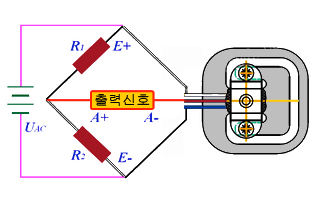
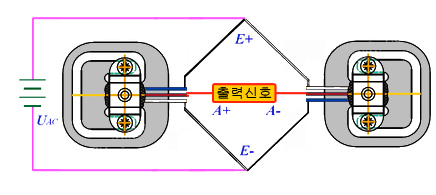
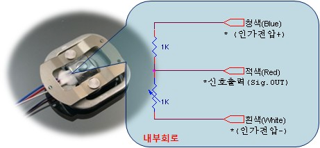
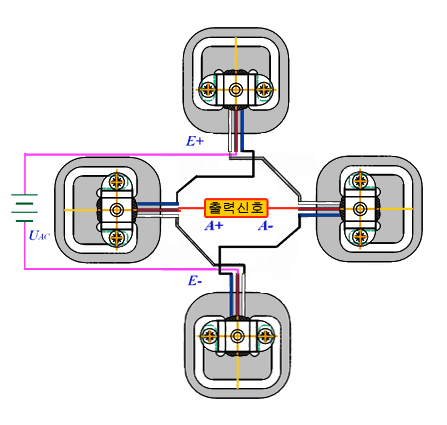
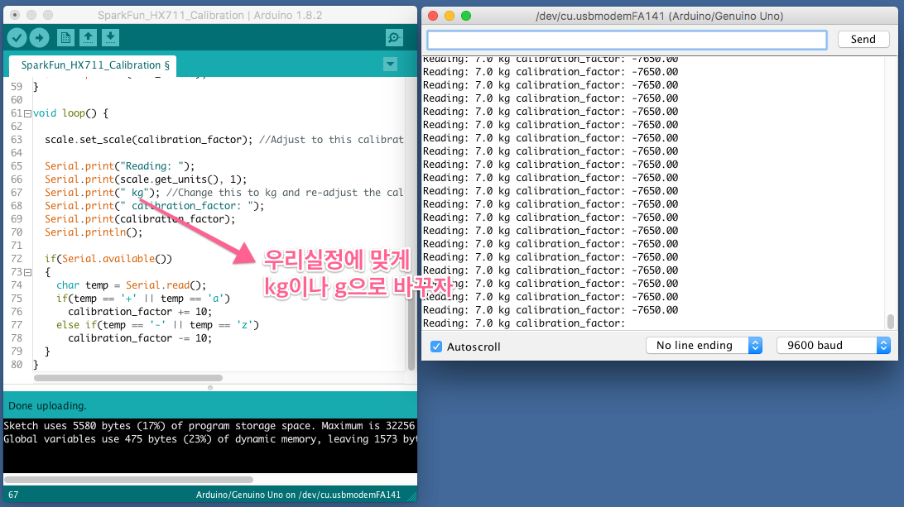

# 센서 사용

### 라즈베리파이 - Pi Camera

- 바코드 센싱
  - 물품 정보 파악
  - DB 전송
- QR 센싱


### 아두이노 - 로드셀 -> 라즈베리파이
- 라이브러리: https://github.com/tatobari/hx711py

- 무게 센싱

  - 실시간 무게 합 계산

  - 상품 바코드로 센싱 후, 추가된 무게 DB 전송

  - 바코드 센싱 없이 

    - 무게 감소할 때: Pi Camera 실행 -> 바코드 센싱 -> 물품 뺀다(DB 전송)
    - 무게 증가할 때: 음성 재생 "바코드를 찍으세요"

  - 과일 등 무게 계산

    - 품목 번호 입력
    - 무게 측정
    - 100g당 가격 계산
    - DB 입력

    

### + 아두이노 - 초음파 센서

- 자동차 바퀴 조립

- 사람 따라다니도록 프로그래밍

  


# 라즈 + 파이썬 + 바코드 예제

https://m.blog.naver.com/PostView.nhn?blogId=heennavi1004&logNo=221526683132&proxyReferer=https:%2F%2Fwww.google.com%2F

<br>

<br>

# 로드셀 HX711 (Load cell HX711)

http://lhdangerous.godohosting.com/wiki/index.php/%EB%A1%9C%EB%93%9C%EC%85%80_HX711_(Load_cell_HX711)

<br>

로드셀은 전자저울에 사용되는 부품. 보통 금속의 미세한 굽힘에 따라 달라지는 미세한 저항의 변화를 측정하는 방식 (strain gauge)으로 무게를 측정한다. 미세한 저항 변화를 감지하기 위해 휘트스톤 브릿지 (Wheatstone bridge)를 구성해 사용하거나, 간편하게 IC로 만들어진 load cell 증폭기(amplifier)를 사용한다. HX711은 이러한 loadcell amplifier의 일종으로, 로드셀을 HX711에 연결하고 다시 HX711을 아두이노등 마이크로 컨트롤러에 연결해 사용한다

<br>

### 3선식 로드셀

3개의 전선을 가지고 있는 로드셀의 경우 휘트스톤브릿지에서 counter-load가 되는 2개의 저항을 사용하던지 동일한 로드셀을 2개, 혹은 4개를 짝지워 사용해야함. 

<br>

             

  

<br>

<br>

## 아두이노에서

### 미니멈 코드

```c++
#include "HX711.h"

#define calibration_factor -7050.0 //캘리브레이션을 통해 얻어진 값을 여기 넣는다.

#define DOUT  3 //데이터 핀
#define CLK  2 // 클럭 핀

HX711 scale(DOUT, CLK);

void setup() {
  Serial.begin(9600);  // 값 모니터링 위해서...
  scale.set_scale(calibration_factor); 
  scale.tare();	//영점잡기. 현재 측정값을 0으로 둔다.
}

void loop() {
  Serial.print(scale.get_units()); //scale.get_units() returns a float
}
```

<br>

### Step1. 라이브러리 설치

bogde가 편리한 형태로 라이브러리를 잘 만들어 두었다. [파일:HX711.zip](http://lhdangerous.godohosting.com/wiki/index.php/파일:HX711.zip) 아두이노 개발환경에서 Sketch 메뉴 > Include Library > Add .zip library로 라이브러리를 설치.

<br>

### Step2. Calibration

주어진 상황에서 최초 영점을 잡기위해 캘리브레이션을 해 주어야 한다. 스파크펀에서 캘리브레이션용 스케치를 만들어 배포하고있다. [파일:SparkFun HX711 Calibration.zip](http://lhdangerous.godohosting.com/wiki/index.php/파일:SparkFun_HX711_Calibration.zip)

```
#include "HX711.h"

#define DOUT  3 //데이터핀 3번핀 
#define CLK  2   // 클럭핀 2번핀 

HX711 scale(DOUT, CLK);

float calibration_factor = -7050;    //로드셀 종류나 상황에 따라 적당한 값으로 시작

void setup() {
  Serial.begin(9600);
  Serial.println("HX711 calibration sketch");
  Serial.println("Remove all weight from scale");
  Serial.println("After readings begin, place known weight on scale");
  Serial.println("Press + or a to increase calibration factor");
  Serial.println("Press - or z to decrease calibration factor");

  scale.set_scale();
  scale.tare();	//Reset the scale to 0

  long zero_factor = scale.read_average(); //Get a baseline reading
  Serial.print("Zero factor: "); //This can be used to remove the need to tare the scale. Useful in permanent scale projects.
  Serial.println(zero_factor);
}

void loop() {

  scale.set_scale(calibration_factor); //Adjust to this calibration factor

  Serial.print("Reading: ");
  Serial.print(scale.get_units(), 1);
  Serial.print(" kg"); //Change this to kg and re-adjust the calibration factor if you follow SI units like a sane person 우리 한국인은 모두 이성적이므로^^
  Serial.print(" calibration_factor: ");
  Serial.print(calibration_factor);
  Serial.println();

  if(Serial.available())
  {
    char temp = Serial.read();
    if(temp == '+' || temp == 'a')
      calibration_factor += 10;
    else if(temp == '-' || temp == 'z')
      calibration_factor -= 10;
  }
}
```

<br>

  


 배포되는 스케치에는 무게 단위가 lbs (파운드)로 표시되어있으므로 kg이나 g으로 바꾸어도 좋다. 그렇지만 바꾸지 않아도 기능적으로 아무런 문제는 없다. 그냥 1lbs로 표시되면 '음 1kg이군.'이라고 알아서 이해하면 족하다. (캘리브레이션은 스트레인 변화에대한 출력값의 변화 **비율**을 알아내는 것으로, 비율에는 단위가 필요없다.) 회로를 연결한 후 캘리브레이션 스케치를 실행시키고 시리얼 모니터를 열어둔다. (baud rate를 9600으로 맞추는 것 잊지말자) 로드셀에 아무것도 올려놓지 않은 상태에서 reading이 0.0이 되는 것을 확인 한 후, 이미 정확한 무게를 알고있는 물체 (추) 를 로드셀에 올려놓고 시리얼 모니터를 통해 +와 - (혹은 a와z)를 입력하면서 reading값이 물체의 무게(예를들면 1kg)와 같아질 때까지 calibration_factor를 조절한다. 이렇게 구해진 calibration_factor 값을 잘 기억해둔다. 캘리브레이션은 세팅이 바뀌지 않는 한 최초1번만 하면 된다.

<br>

### Step3. 스케치 작성

-   먼저 **#include "HX711.h"**로 라이브러리를 불러들인 후

-   **HX711 scale(datapin, clockpin);** 으로 오브젝트를 만들고

-   setup()에서

    -   **scale.set_scale(calibration_factor);**로 앞서 측정한 캘리브레이션 값을 적용한다.
-   **scale.tare();** 는 현재 상태를 0으로 만드는 함수로, 용기사용 등 사용중 영점 조절 필요한 순간에도 유용하게 쓸 수 있다.
    
-   loop()에서,

    -   **float**을 리턴하는 **scale.get_units()**로 값을 읽어와 사용한다.

<br>
