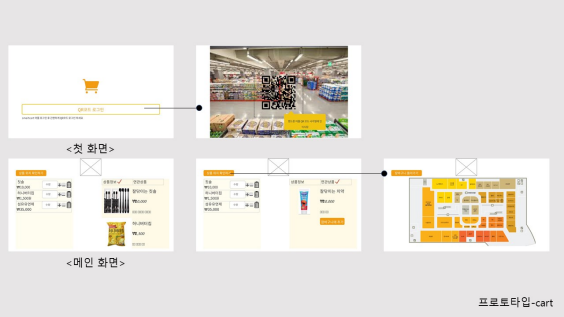
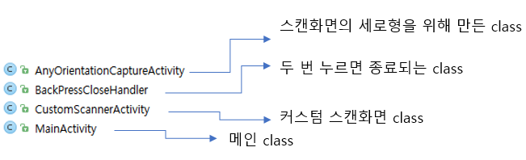
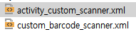
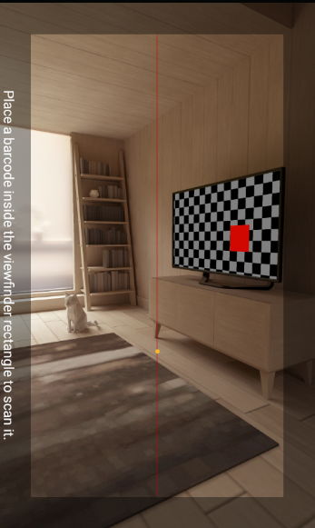

# 프로토타입

  

<br>

  

<br>

<br>


<details>
<summary>[[안드로이드]커스텀 zxing(custom바코드스캐너)
</summary>

zxing 은 안드로이드에서 바코드인식을 하기위해 많이 사용합니다.


https://github.com/journeyapps/zxing-android-embedded#custom-layout

(zxing 라이브러리 github입니다)


zxing 을 이용하여 바코드 인식하는 정보는 매우 많은데요. 


바코드를 커스텀하는 내용은 많이 없어서 이번에 간단히 바코드화면에 버튼을 넣은 간단한 커스텀 zxing을 알아보겠습니다.


(현재 만들고 있는 어플에 사용될 스캔화면)


보시는것처럼 좌측상단과 우측상단에 이미지 버튼을 만들어주어 톱니바퀴 모양을 누를경우 환경설정, 번개? 모양을 누를 경우 어두운 공간에서도 스캔이 가능하게 핸드폰의 라이트를 켜고 끌 수 있는 기능을 만들어두었습니다.


github의 자료를 받으시면 누구나 조금의 분석만 하면 커스텀할수 있습니다.


하지만 그 시간도 절약 할 수 있게 간단히 알려드릴게요.


```kotlin
compile 'com.journeyapps:zxing-android-embedded:3.5.0'
```

먼저 zxing사용을 위해 dependencies 에 zxing라이브러리를 추가해 줍시다!




다음으로 저는 4개의 클래스를 사용하였습니다.


AnyOrientationCaptureActivity 는 스캔화면의 세로형을 위해 만듭니다.

```kotlin
public class AnyOrientationCaptureActivity extends CaptureActivity {

}
```

CaptureActivity를 상속받는 빈 class를 만들어서 

```kotlin
<activity
            android:name=".AnyOrientationCaptureActivity"
            android:screenOrientation="fullSensor"
            android:stateNotNeeded="true"
            android:theme="@style/zxing_CaptureTheme"
            android:windowSoftInputMode="stateAlwaysHidden"></activity>
```

manifests 에 엑티비티를 추가해주면 세로모드가 가능합니다.


BackPressCloseHandler 는 제가 필요해서 만든 class 로 저는 main화면이 스캐너화면이라 onResume 에서 스캔화면을 계속불러 오기때문에 한번의 close로는 종료가 되지않아 두번 누르면 **activity**.finishAffinity(); 모든 엑티비티가 종료되도록 만들어 두었습니다. 이 finishAffinity() 는 api16 이상부터 사용가능합니다.


CustomScannerActivity 는 커스텀스캐너를 불러오고 라이트 넣어놓은 class 입니다.

```kotlin
    private CaptureManager capture;
    private DecoratedBarcodeView barcodeScannerView;
```

여기서는 CaptureManager와 DecoratedBarcodeView 를 통해 커스텀한 xml을 불러와 스캔화면에 적용시켜줍니다.

```kotlin
barcodeScannerView = (DecoratedBarcodeView)findViewById(R.id.zxing_barcode_scanner);
barcodeScannerView.setTorchListener(this);
```

DecorateBarcodeView 에 만들어둔 xml 을 적용시키고 라이트를 켜고끄기위한 Torch리스너를 연결하였습니다.


```kotlin
        capture = new CaptureManager(this, barcodeScannerView);
        capture.initializeFromIntent(getIntent(), savedInstanceState);
        capture.decode();
```

그리고 CaptureManager 에 DecorateBarcodeView 를 연결시켜준뒤 decode 를 해주면 됩니다.


Main 에서는 

```kotlin
        IntentIntegrator integrator = new IntentIntegrator(this);
        integrator.setCaptureActivity(CustomScannerActivity.class);
        integrator.initiateScan();
```

커스텀 엑티비티를 initiateScan() 해주어 스캔을 불러와서 사용할수있게 하였습니다. 저는 Resume 에서 불러와 계속스캔화면을 불러올수 있게 하였습니다(main이 스캔)


그리고 결과값을 받아오기위하여 

```kotlin
    @Override
    public void onActivityResult(int requestCode, int resultCode, Intent intent) {
        Log.d("onActivityResult", "onActivityResult: .");
        if (resultCode == Activity.RESULT_OK) {
            IntentResult scanResult = IntentIntegrator.parseActivityResult(requestCode, resultCode, intent);
            String re = scanResult.getContents();
            String message = re;
            Log.d("onActivityResult", "onActivityResult: ." + re);
            Toast.makeText(this, re, Toast.LENGTH_LONG).show();
        }
    }
```

onActivityResult 를 오버라이드하여 바코드값을 토스트로 확인할수 있습니다.


xml은 



activity_custom_scanner 에서 custom_barcode_scanner 를 layout하게 되어있습니다.


글을 쓰다보니 내용이 이상해 진거 같은데 ㅜㅜ


자세한 코드나 도움이 필요하면 댓글남겨주세요


\--------------------------------------------------------------------------------------------------------------------------------------

코드원하시는분이 많아 깃에 올려두었습니다.

https://github.com/dolsanta/CustomZxingTest

</details>


<br>

<details>
<summary>안드로이드 스튜디오 QR코드 (생성)
</summary>

​    

https://park-duck.tistory.com/108

안녕하세요 

zxing 을 이용하여 qr코드를 생성, 스캔을 해보겠습니다.

이번 글에서는 생성만 다루며 

https://github.com/journeyapps/zxing-android-embedded 를 참고&사용하였습니다.

 





먼저 빈 액티비티 만들겠습니다 

 

 

 


(위 사진은 이해를 돕기위한 코드입니다.)

먼저 위 사진의 IntentIntegrator는 QR코드를 사용하기위한 클래스 중 하나인데 

찾을 수 없는 클래스라고 하네요.

QR관련 클래스들을 가져와야겠습니다.

 

 

 


build.gradle(module)에서 위와 같이 코드를 추가합니다.

**implementation 'com.journeyapps:zxing-android-embedded:3.6.0'**

 

해당 깃헙 사이트를 들어가보시면

appcompat-v7:23 이상을 요구하며 

 

**SDK의 버전이 19이상이면 3.6.0 버전**을,

**SDK의 14이상도 지원하고싶으면 zxing:core3.3.0**을 사용하라고 하네요.

implementation 'com.journeyapps:zxing-android-embedded:3.6.0' 를

**implementation('com.journeyapps:zxing-android-embedded:3.6.0') { transitive = false }**

**implementation 'com.google.zxing:core:3.3.0'**

으로 고치라고 합니다.

 

 

저는 예제만 간단히 할 것이니 3.6.0버전을 사용하겠습니다.

동기화(Sync Now) 후 빌드를 해봅니다!

 

23번줄 **implementation 'com.android.support:appcompat-v7:28.0.0'**에

Error: Program type already present: android.support.v4.app.ActivityCompat$OnRequestPermissionsResultCallback 에러가 난다면

**implementation** **'com.android.support:support-v4:28.0.0'** 를 추가한 후 동기화해보세요

 

 

 

 


TextureView를 사용하기 때문에 

AndroidManifest.xml파일에 **android:hardwareAccelerated="true"** 를 추가해줍니다.

 

이제 세팅을 마쳤으니 구현부분으로 넘어갑시다!

 

 

 


먼저 QR코드를 생성하는 액티비티와

QR코드를 스캔하는 액티비티를 구현할 것이니

빈 액티비티를 두개 (ScanQR, CreateQR)를 만들어 줍니다.

그럼

 

**Main(MainActivity.java + activity_main.xml)**

**CreateQR(CreateQR.java + activity_create_qr.xml)**

**ScanQR(ScanQR.java + activity_scan_qr.xml)**

 

이렇게 세가지로 나뉘겠네요

 

먼저 Main입니다.

 

**MainActivity.java**

 

```java
package com.example.myqrcode;
 
import android.content.Intent;
import android.support.v7.app.AppCompatActivity;
import android.os.Bundle;
import android.view.View;
import android.widget.Button;
 
import com.google.zxing.integration.android.IntentIntegrator;
 
public class MainActivity extends AppCompatActivity {
    private Button createQRBtn;
    private Button scanQRBtn;
 
    @Override
    protected void onCreate(Bundle savedInstanceState) {
        super.onCreate(savedInstanceState);
        setContentView(R.layout.activity_main);
 
        createQRBtn = (Button) findViewById(R.id.createQR);
        scanQRBtn = (Button) findViewById(R.id.scanQR);
 
        createQRBtn.setOnClickListener(new View.OnClickListener(){
            public void onClick(View v){
                Intent intent = new Intent(MainActivity.this, CreateQR.class);
                startActivity(intent);
            }
        });
 
        scanQRBtn.setOnClickListener(new View.OnClickListener(){
            public void onClick(View v){
                Intent intent = new Intent(MainActivity.this, ScanQR.class);
                startActivity(intent);
            }
        });
    }
}
```

이 부분은 액티비티 넘기는 것 뿐이니 설명은 안하겠습니다. 

 

 

 

**activity_main.xml**

```xml
<RelatieLayout xmlns:android="http://schemas.android.com/apk/res/android"
    xmlns:tools="http://schemas.android.com/tools"
    android:layout_width="match_parent"
    android:layout_height="match_parent"
    tools:context=".MainActivity">
 
    <LinearLayout
        android:layout_width="wrap_content"
        android:layout_height="wrap_content"
        android:layout_centerVertical="true"
        android:layout_centerHorizontal="true"
        android:orientation="horizontal">
        <Button
            android:layout_width="wrap_content"
            android:layout_height="wrap_content"
            android:text="QR Create"
            android:id="@+id/createQR"/>
 
        <Button
            android:layout_width="wrap_content"
            android:layout_height="wrap_content"
            android:text="QR Scan"
            android:id="@+id/scanQR"/>
    </LinearLayout>
</RelativeLayout>
```

이 부분은 액티비티 넘기는 것 뿐이니 설명은 안하겠습니다2

 

 

다음은 CreateQR입니다.

 

**CreateQR.java**

```java
package com.example.myqrcode;
 
import android.graphics.Bitmap;
import android.support.v7.app.AppCompatActivity;
import android.os.Bundle;
import android.widget.ImageView;
 
import com.google.zxing.BarcodeFormat;
import com.google.zxing.MultiFormatWriter;
import com.google.zxing.common.BitMatrix;
import com.journeyapps.barcodescanner.BarcodeEncoder;
 
public class CreateQR extends AppCompatActivity {
    private ImageView iv;
    private String text;
    @Override
    protected void onCreate(Bundle savedInstanceState) {
        super.onCreate(savedInstanceState);
        setContentView(R.layout.activity_create_qr);
 
        iv = (ImageView)findViewById(R.id.qrcode);
        text = "https://park-duck.tistory.com";
 
        MultiFormatWriter multiFormatWriter = new MultiFormatWriter();
        try{
            BitMatrix bitMatrix = multiFormatWriter.encode(text, BarcodeFormat.QR_CODE,200,200);
            BarcodeEncoder barcodeEncoder = new BarcodeEncoder();
            Bitmap bitmap = barcodeEncoder.createBitmap(bitMatrix);
            iv.setImageBitmap(bitmap);
        }catch (Exception e){}
    }
}
```

BitMatrix, BarcodeFormat, BarcodeEncoder 모두 아까 가져온

journeyapps에서 가져온 것들입니다.

클래스 이름만 봐도 알 수 있듯이

바코더인코더를 이용해 QR코드를 만들어 비트맵이미지에 적용하는 것이네요

 

BitMatrix.encode는 contents, format,width, height 를 인자로 받습니다.

contents 부분에 원하는 내용,

format부분에는 바코드 포맷형식,

width, height에는 가로 세로 크기를 지정해주면 되겠죠?

 

 

 

**activity_create_qr.xml**

```xml
<?xml version="1.0" encoding="utf-8"?>
<RelativeLayout xmlns:android="http://schemas.android.com/apk/res/android"
    xmlns:tools="http://schemas.android.com/tools"
    android:layout_width="match_parent"
    android:layout_height="match_parent"
    tools:context=".CreateQR"
    android:orientation="vertical">
 
    <ImageView
        android:layout_width="match_parent"
        android:layout_height="match_parent"
        android:id="@+id/qrcode"
        android:layout_centerVertical="true"
        android:layout_centerHorizontal="true"/>
 
</RelativeLayout>
```

xml은 이미지뷰 하나뿐이니 패스하겠습니다 ^^

 

 

 


시뮬로 돌린 어플입니다.

Create 버튼을 누르면 위와 같이 QR코드가 생성이 되네요 ^^

 

스캐닝 부분은 다음글에 포스팅 하겠습니다.

 

</details>


<br>


<details>
<summary>안드로이드 스튜디오 QR코드 (스캔)
</summary>
​    

https://park-duck.tistory.com/109

 

ScanQR.java부분입니다.

```java
package com.example.myqrcode;
 
import android.content.Intent;
import android.support.v7.app.AppCompatActivity;
import android.os.Bundle;
import android.widget.Toast;
 
import com.google.zxing.integration.android.IntentIntegrator;
import com.google.zxing.integration.android.IntentResult;
 
public class ScanQR extends AppCompatActivity {
 
    @Override
    protected void onCreate(Bundle savedInstanceState) {
        super.onCreate(savedInstanceState);
        setContentView(R.layout.activity_scan_qr);
 
        new IntentIntegrator(this).initiateScan();
    }
 
    @Override
    protected void onActivityResult(int requestCode, int resultCode, Intent data) {
        IntentResult result = IntentIntegrator.parseActivityResult(requestCode, resultCode, data);
        if(result != null) {
            if(result.getContents() == null) {
                Toast.makeText(this, "Cancelled", Toast.LENGTH_LONG).show();
                // todo
            } else {
                Toast.makeText(this, "Scanned: " + result.getContents(), Toast.LENGTH_LONG).show();
                // todo
            }
        } else {
            super.onActivityResult(requestCode, resultCode, data);
        }
    }
}
```

https://github.com/journeyapps/zxing-android-embedded 예제 그대로입니다.

 

스캔 간단합니다!

new IntentIntegrator(this).initiateScan();

이것 한줄만 추가하면 스캔이 됩니다.

 

하지만 결과값을 받아와야겠죠?

onActivityResult가 결과값을 받아 처리하는 함수입니다.

 

result.getContents()가 qr코드를 읽어 가져오는 부분입니다.

null이 아니면 결과값이 있단거겠죠?

 

xml구현은 딱히 필요없네요

그 후 상황에 따라 맞는 구현을 하시면 되겠습니다.

 


시뮬레이터로 돌린 스캔부분 캡쳐입니다.

가로방향이라 마음에안드네요...

다음 글에는 방향전환과

"Place a barcode inside eth viewfinder rectangle to scan it."

문구를 바꿔보겠습니다!

</details>

